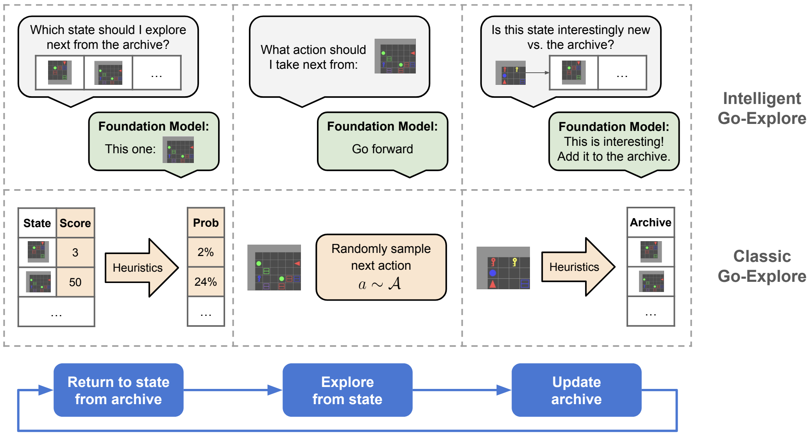

# Intelligent Go-Explore

[](https://arxiv.org/abs/2405.15143)
[](https://www.conglu.co.uk/IntelligentGoExplore)
[](https://twitter.com/jeffclune/status/1797541076024308135)

<p align="center">
  
</p>

Intelligent Go-Explore (IGE) integrates the intelligence and internalized human notions of interestingness from giant
pretrained foundation models into all stages of the Go-Explore algorithm, enabling foundation model agents to robustly
explore in complex environments.

**_Intelligent Go-Explore: Standing on the Shoulders of Giant Foundation Models_**; Cong Lu, Shengran Hu, Jeff Clune.

<p align="center">
  <a href=https://arxiv.org/abs/2405.15143>View on arXiv</a>
</p>

## Setup

To install, clone the repository and run the following:

```bash
conda create -n ige python=3.11
conda activate ige
pip install -r requirements.txt

# BabyAI-Text Instructions
git clone https://github.com/flowersteam/Grounding_LLMs_with_online_RL.git
cd Grounding_LLMs_with_online_RL
pip install blosc; cd babyai-text/babyai; pip install -e .; cd ..
cd gym-minigrid; pip install -e.; cd ..
pip install -e .

# TextWorld Instructions (see https://github.com/microsoft/TextWorld for system libraries)
pip install textworld
```

## Running Instructions

### Notes

- Each environment is one clean file, containing the environment, IGE, baselines, and prompts.
- By default, all runs are enabled, comment out baselines that you don't want.
- Ensure that `OPENAI_API_KEY` is set in the environment variables.

### Game of 24

```bash
python3 game_of_24/run.py
```

### BabyAI-Text

```bash
python3 babyai/run.py
```

### TextWorld

```bash
# Run Coin Collector
python3 textworld/run_coin.py

# Run The Cooking Game
python3 textworld/run_cooking.py

# Run Treasure Hunter
python3 textworld/run_treasure.py
```

**N.B.** In order to generate the game files we used in TextWorld found in `tw_games`, we used
the `text_world/misc/make_*.py`
scripts.

## Citation

If you find this project useful, please consider citing:

```
@article{lu2024IntelligentGoExplore,
title={{Intelligent Go-Explore}: Standing on the Shoulders of Giant Foundation Models},
author={Lu, Cong, and Hu, Shengran and Clune, Jeff},
journal={arXiv preprint arXiv:2405.15143},
year={2024}
}
```

## Contact

Please contact [Cong Lu](mailto:conglu97*AT*outlook*DOT*com) for any queries.
